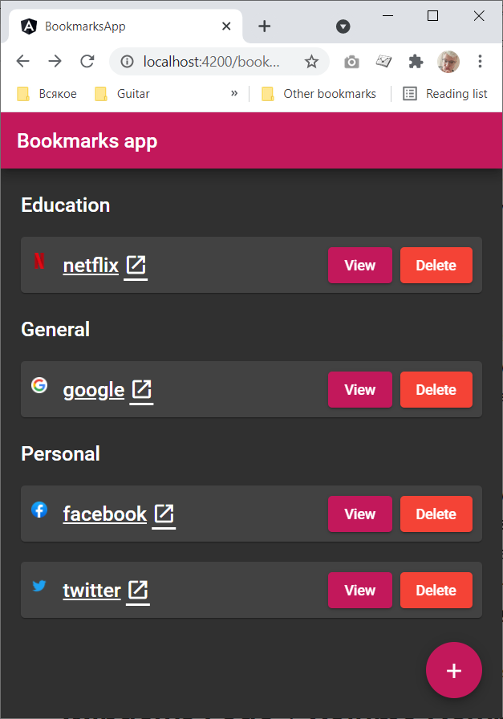
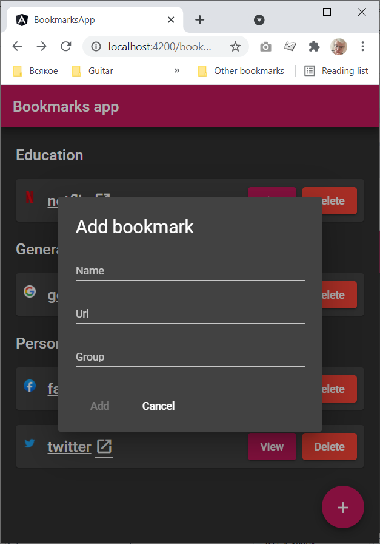
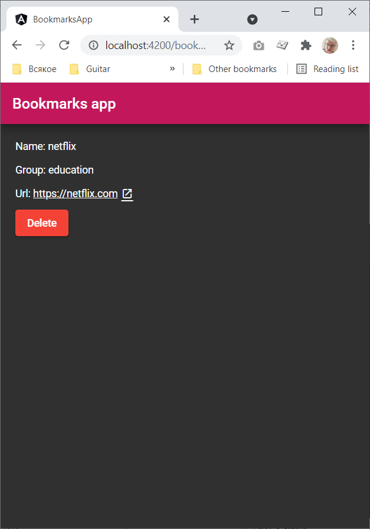
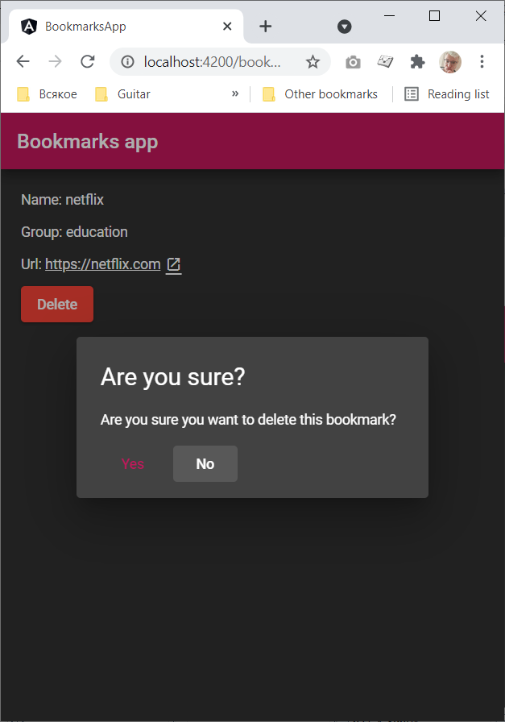
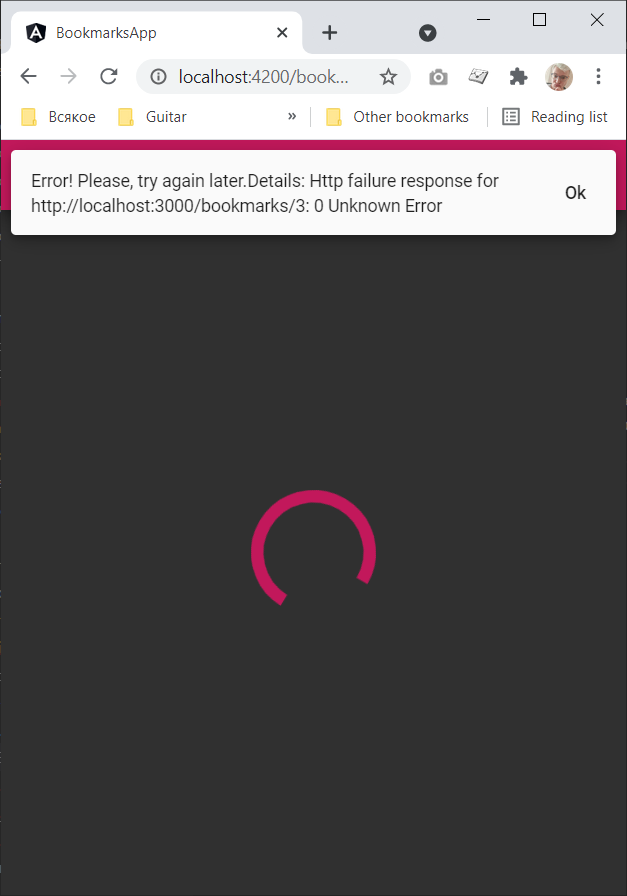

# BookmarksApp

A test application for saving bookmarks.

## How to run

Execute the following command in the console to start fake rest api server:

    $ npm run server

In the separate console run this command to start an application:

    $ ng serve

Open the following url in your browser: http://localhost:4200

## Test coverage

Covered:

  - [bookmark-card.component.ts](src/app/features/bookmarks/components/bookmark-card/bookmark-card.component.ts)
  - [bookmarks.service.ts](src/app/features/bookmarks/services/bookmarks/bookmarks.service.ts)
  - [add-bookmark-modal.component](src/app/features/bookmarks/services/add-bookmark-modal/add-bookmark-modal.component)

## Screenshots

Bookmarks page

Add new bookmark modal

Bookmark details page

Delete bookmark modal

In case of there is no internet connection or other kind of error, the floating message will be displayed

